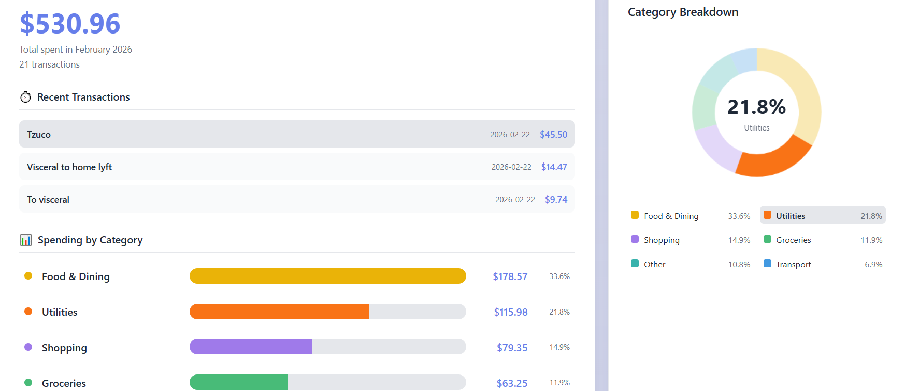
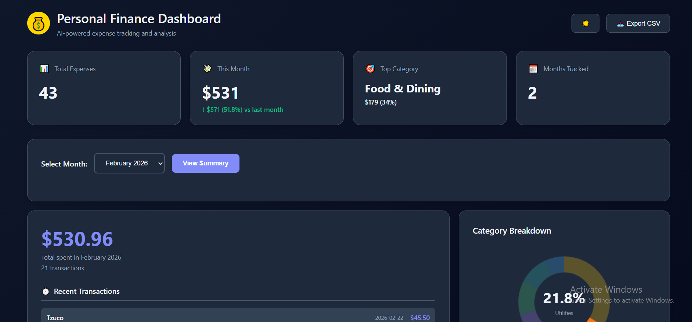
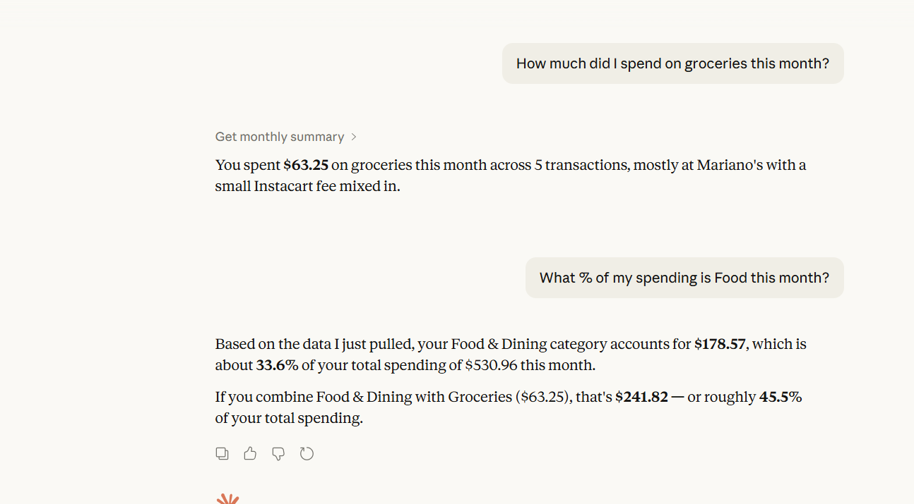

# Personal Finance AI Agent

An AI-powered expense tracking and categorization system that connects to Splitwise, uses Open AI to automatically categorize expenses, and generates professional Excel reports and a dashboard to visualize transactions.

## Features

- **Splitwise Integration**: Automatically sync expenses from your Splitwise account
- **AI Categorization**: Uses Open AI to intelligently categorize expenses
- **Smart Caching**: Reduces API calls by caching similar expense categorizations
- **Monthly Reports**: Generate detailed Excel reports with summaries and breakdowns
- **MCP Server**: Exposes tools via Model Context Protocol for LLM integration
- **Web Dashboard**: Web interface to view your spending analytics
- **SQLite Storage**: Lightweight, portable database with no setup required

## Prerequisites

- Node.js 18 or higher
- Splitwise account with API access
- OpenAI API key

## Quick Start

### 1. Clone and Install

```bash
cd finance-agent
npm install
```

### 2. Configure Environment

Copy `.env.example` to `.env` and fill in your credentials:

```bash
cp .env.example .env
```

Edit `.env`:
```env
SPLITWISE_API_KEY=your_splitwise_api_key_here
OPENAI_API_KEY=your_openai_api_key_here
DATABASE_PATH=./data/finance.db
PORT=3000
```

**Get your API keys:**
- **Splitwise**: https://secure.splitwise.com/apps (Refer to [scripts/get-splitwise-token.js](scripts/get-splitwise-token.js))
- **OpenAI**: https://platform.openai.com/api-keys

### 3. Sync Your Expenses

```bash
npm run sync
```

This fetches all your expenses from Splitwise and stores them locally.

### 4. Categorize Expenses

```bash
npm run categorize
```

Uses Open AI to automatically categorize all uncategorized expenses. The system intelligently caches similar expenses to minimize API calls.

### 5. Generate Reports

```bash
npm run report
```

Interactive CLI to generate Excel reports:
- Monthly reports (detailed breakdown)
- Year-to-date summaries
- Batch export all months

Reports are saved to `./exports/`

## MCP Server

The MCP server can be started with the following command:

```bash
npm run mcp
```


### Available Tools

1. **categorize_expense**: Categorize a single expense
2. **get_monthly_summary**: Get aggregated monthly summary
3. **fetch_expenses**: Sync from Splitwise
4. **categorize_all_uncategorized**: Batch categorize expenses
5. **export_to_excel**: Generate Excel report
6. **get_ytd_summary**: Year-to-date summary
7. **list_available_months**: List months with data
8. **get_expense_categories**: Get category list

### MCP Integration Example

Add to your Claude Desktop config (`~/Library/Application Support/Claude/claude_desktop_config.json` on macOS):

```json
{
  "mcpServers": {
    "finance-agent": {
      "command": "node",
      "args": ["/path/to/finance-agent/src/mcp/server.js"]
    }
  }
}
```

## Web Dashboard

Launch a local web dashboard to visualize your spending:

```bash
npm run dashboard
```

Then open http://localhost:3000 in your browser.

<p style="display:flex;gap:12px;align-items:flex-start;">
  
  
</p>

### Database Location

Default: `./data/finance.db`

To use a different location, set `DATABASE_PATH` in `.env`

### Logs and Debugging

- MCP server logs to stderr
- CLI commands provide verbose output
- Check `./data/` for database file

## Usage Examples

### Daily Workflow

```bash
# sync new expenses
npm run sync

# Categorize any new expenses
npm run categorize

# Generate monthly report
npm run report
```

### Using with Claude Desktop

Once MCP is configured, you can ask Claude:

> "What did I spend on groceries last month?"
> "Categorize my recent Uber expense"
> "Show me my top 5 expenses this month"
> "Export my January spending to Excel"



## 🔄 Incremental Syncs

The sync command automatically tracks the last sync date. Subsequent syncs only fetch new expenses, making it fast and efficient.

To force a full resync:
1. Delete `./data/finance.db`
2. Run `npm run sync`

---

Where to find everything:

- Setup and installation: [docs/SETUP.md](docs/SETUP.md)
- Architecture: [docs/ARCHITECTURE.md](docs/ARCHITECTURE.md)
- Categorization details: [docs/CATEGORIZATION.md](docs/CATEGORIZATION.md)

## Contributing

This is a personal finance tool, but feel free to fork and customize for your needs!
